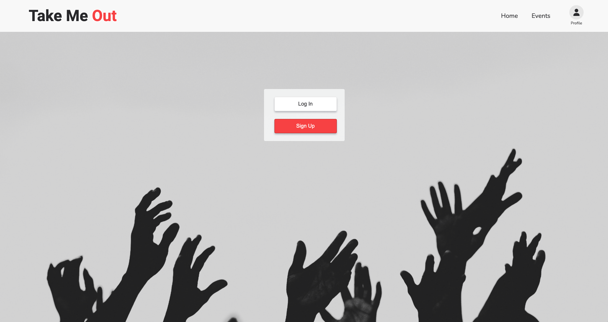

# Take Me Out - An App for Events Near You

An app that helps users discover events happening in their city by highlighting factors users prioritized as well as curated lists of things to do.
The primary aim of the app is to simplify the discovery, planning and booking process for users looking to attend events with a focus on simplicity and clarity highlighting factors users prioritized such as location, pricing, and booking availability.

## Planning & Preperation Documentation

#### Figma Wireframe & Prototype
[Take Me Out - Initial Mobile Wireframe](https://www.figma.com/design/Lvd0ddemON0PUFdVQxMQI1/Take-Me-Out---Initial-Mobile-Wireframe?node-id=38-2&t=RMXAtT6DH6hQYMZz-0)

#### Trello Board for Tickets
[Take Me Out Tickets](https://trello.com/b/icaHud7x/take-me-out)

## Run Locally

1. Upon cloning this repository you will need to run 'npm i' to install any dependencies
2. You can find the server portion here [take-me-out-server](https://github.com/vdalx/take-me-out-server)
3. Repeat step one for the server portion
4. Create your .env files for the client and server - there is a sample.env file available in each for reference
5. You will need to generate a Mapbox token and add it to your .env file
6. On the server side you will need to run migration and seed files
7. The sign up password must have at least 8 characters, one uppercase letter, one lowercase letter, one number and one special character
8. There is one test user set up already - the email is example@email.com and the password is Testing123!

## Screenshot

## Tech Stack

    
    
    
    
    
    
    
    

## Lessons Learned

As a first 'blank canvas' project I tried to implement everything I had learned during my BrainStation adventure to varying levels of success.

From a UX Design persepective I learned two key lessons:

1. Start small with a clear concept of what you’re trying to achieve prior to beginning the user research process.
2. When interviewing and testing you must restrain yourself from “helping” the user.

From a Software Development perspective I learned two more key lessons:

1. Don't be afraid to ask questions. Looking for help when you're stuck isn't always a weakness and spending time trying to find a solution on your own isn't always a strength or the most productive use of your time.
2. Gaps in knowledge and understanding. There are a number of concepts I need to spend more time learning and practising and this project helped me identify what those are.

## Next Steps & Things to Work On

At the moment this is a very basic app which doesn't capture all of the features I had originally envisaged. I would like to continue iterating on those features and make it function the way I had designed it. With that in mind, here's a list of things I would like to add:

1. Improve design and styling of tablet and desktop view - I focused predominantly on mobile.
2. Add functionality to let users click on Get Tickets button (currently left as is as there are no links to access).
3. Create listings and pages for featured venues.
4. Add the ability to upload and display a profile image.
5. Add a spinner to indicate when pages are loading.
6. Refactor code used to confirm logged in status and how profile data is passed to components.